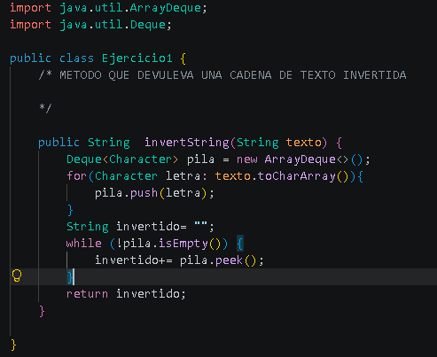

## Estructuras dinamicas lineales 
### Nombre : Jose vega
### Curso : estructura datos

## 1 Implememtacion de estructuras dinamicas lineales
### Fecha: 08 / 06 / 2026
En esta seccion  se implementaran las siguientes estructuras dinamicas lineales 
- Lsitas enlazadas con LinkedList
-  pilas con Stack y Deque
- Colas con Queue

## ejercicio 1
- invertir un estring usando una pila 
